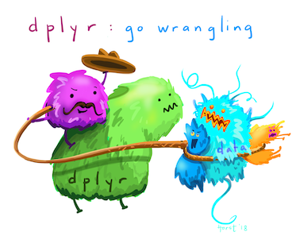
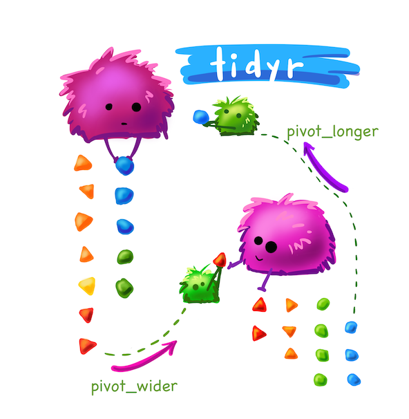

<!--
# ASSIGNMENT CONFIG
requirements: requirements.R
generate:
  show_stdout: true
  show_hidden: true
export_cell: false
files:
  - img
  - data
-->

```{r setup, include=FALSE}
knitr::opts_chunk$set(echo = TRUE)
```

Welcome to worksheet 1! This worksheet was designed to allow you to practice what was covered in the assigned readings & lectures/recordings. The labs problems will be more challenging than those in the worksheet, and the worksheet questions will help prepare you for them. Time will be provided to work on the worksheets in small groups during lecture, however it is not expected that you will complete the worksheet in this time. You are expected to spend some independent time working on the worksheet after lecture.

<mark>To ensure you do not break the autograder remove all code for installing packages (i.e., DO NOT have `install.packages(...)` or `devtools::install_github(...)` in your homework!</mark>

**Worksheets are due on Saturdays at 6 pm, and must be submitted as `.Rmd` file and the rendered `pdf` in this worksheet/lab to Gradescope.**

### Worksheet mechanics

- **There is autograding in this lab, so please do not move or rename this file. Also, do not copy and paste cells, if you need to add new cells, create new cells via the "Insert a cell below" button instead.**

Run the cell below to load the libraries needed for this worksheet, and to check your answers as you go!

```{r}
library(digest)
library(readxl)
library(testthat)
library(readr)
library(dplyr)
library(tidyr)
library(ggplot2)
```

> Note - there is an issue with loading packages with `tidyverse` and the autograding software we are using.
Thus, for assignments, please load the packages individually as I have done above instead of loading them via the tidyverse.


# 1.0 Reading data into R

Before you can do any data analysis, you need to load your data into R! Thus we will spend some time practicing how to get these types of files into R!

> The data we will use to explore this is the Palmer penguins data set! In this data set there are measures on the three species of penguins shown in this illustration below. You can learn more about the penguins and this data set [here](https://allisonhorst.github.io/palmerpenguins/). 
>
> Illustration by [Allison Horst](https://www.allisonhorst.com/)

### Reading in local files

In the `data` directory of this repository we have provided you with 5 different versions of the same data set in different file formats. Your task is to read each of these into R using an appropriate function.

As in lecture, we highly recommend using the `readr::read*` functions in comparison to the base R `read.*` functions because of performance. *Note - for excel files you will have to use the `readxl` package instead of `readr`.* **Do look at each file in the Jupyter editor and consult the [Data Import Cheatsheet](https://github.com/rstudio/cheatsheets/raw/main/data-import.pdf) to help you choose the correct function and function argument.**

Prove to us that you were successful by outputting the head of each data frame once it is read in.

<!--
# BEGIN QUESTION
name: e11
manual: false
points: 1
-->

### Exercise 1.1

rubric={autograde:1}

Read in file named `penguins.csv` from the `data` directory. Bind the name `penguins_csv` to the data frame.

<!-- # BEGIN SOLUTION -->

```{r}
penguins_csv <- NULL

# BEGIN SOLUTION NO PROMPT
penguins_csv <- read_csv("data/penguins.csv") 
# END SOLUTION

head(penguins_csv)
```

<!-- # END SOLUTION -->

<!-- # BEGIN TESTS-->

```{r}
# TESTS
expect_equal(nrow(penguins_csv), 344)
expect_equal(ncol(penguins_csv), 8)
expect_equal(paste(tolower(sort(colnames(penguins_csv))), collapse = ""), 'bill_depth_mmbill_length_mmbody_mass_gflipper_length_mmislandsexspeciesyear')
expect_equal(round(as.numeric(sum(penguins_csv$bill_length_mm, na.rm = TRUE))), 15021)
```

<!-- # END TESTS -->

<!-- # END QUESTION -->

<!--
# BEGIN QUESTION
name: e12
manual: false
points: 1
-->

### Exercise 1.2
rubric={autograde:1}

Read in file named `penguins-meta-data.csv` from the `data` directory. Bind the name `penguins_meta_data` to the data frame.

*Hint, if there are no column names you can add them by adding `col_names = c("col1", "col2", ...)` as an argument to the `read_*` function. If you need to do this, use the column names from the other penguins data sets above.*

<!-- # BEGIN SOLUTION -->

```{r}
penguins_meta_data <- NULL
# BEGIN SOLUTION NO PROMPT
penguins_meta_data <- read_csv("data/penguins-meta-data.csv", 
                               skip = 9,
                               n_max = 344,
                               col_names = c("species", "island", "bill_length_mm", 
                                           "bill_depth_mm", "flipper_length_mm", 
                                           "body_mass_g", "sex", "year"))
# END SOLUTION
head(penguins_meta_data)
tail(penguins_meta_data)
```

<!-- # END SOLUTION -->

<!-- # BEGIN TESTS-->

```{r}
# TESTS
expect_equal(nrow(penguins_meta_data), 344)
expect_equal(ncol(penguins_meta_data), 8)
expect_equal(paste(tolower(sort(colnames(penguins_meta_data))), collapse = ""), 'bill_depth_mmbill_length_mmbody_mass_gflipper_length_mmislandsexspeciesyear')
expect_equal(round(as.numeric(sum(penguins_meta_data$bill_length_mm, na.rm = TRUE))), 15021)
```


<!-- # END TESTS -->

<!-- # END QUESTION -->

# 2.0 Data wrangling with {dplyr} functions

Once you get your data into R, you often want to transform the data into a more suitable format for data anlaysis. We often refer to this process lovingly as data wrangling. Let's get familiar using some functions from the {dpyr} package functions for data wrangling. {dpyr} is an R packages that is part of the {tidyverse} meta-package.

> 
> 
> 
> Illustration by [Allison Horst](https://www.allisonhorst.com/)

Let's continue to use the 🐧 (penguins) data set to explore these functions! Here's a reminder of what it looks like:

```{r}
# run this cell to view the penguins data set
penguins_csv
```

**Also, don't forget to consult the [Data transformation cheat sheet](https://github.com/rstudio/cheatsheets/blob/main/data-transformation.pdf) if you need help remembering how the {dplyr} functions work.**

<!--
# BEGIN QUESTION
name: e21
manual: false
points: 1
-->

### Exercise 2.1
rubric={autograde:1}

Use the {dplyr} `filter()` function to create a smaller data frame (from the `penguins_csv` data frame) with just the rows for female penguins. Bind the name `female_penguins` to this smaller data frame.

<!-- # BEGIN SOLUTION -->

```{r}
female_penguins <- NULL
# BEGIN SOLUTION NO PROMPT
female_penguins <- filter(penguins_csv, sex == "female")
# END SOLUTION
head(female_penguins)
```

<!-- # END SOLUTION -->

<!-- # BEGIN TESTS-->

```{r}
# TESTS
expect_equal(nrow(female_penguins), 165)
expect_equal(ncol(female_penguins), 8)
expect_equal(paste(tolower(sort(colnames(female_penguins))), collapse = ""), 'bill_depth_mmbill_length_mmbody_mass_gflipper_length_mmislandsexspeciesyear')
expect_equal(round(as.numeric(sum(female_penguins$bill_length_mm, na.rm = TRUE))), 6946)
```

<!-- # END TESTS -->

<!-- # END QUESTION -->

<!--
# BEGIN QUESTION
name: e22
manual: false
points: 1
-->

### Exercise 2.2
rubric={autograde:1}

Use the {dplyr} `arrange()` function to find the smallest penguin (as measured by `body_mass_g`) in the `penguins_csv` data frame. Bind the name `ordered_by_size` to this smaller data frame.

<!-- # BEGIN SOLUTION -->

```{r}
ordered_by_size <- NULL
# BEGIN SOLUTION NO PROMPT
ordered_by_size <- arrange(penguins_csv, body_mass_g)
# END SOLUTION
head(ordered_by_size)
```

<!-- # END SOLUTION -->

<!-- # BEGIN TESTS-->

```{r}
# TESTS
expect_equal(nrow(ordered_by_size), 344)
expect_equal(ncol(ordered_by_size), 8)
expect_equal(paste(tolower(sort(colnames(ordered_by_size))), collapse = ""), 'bill_depth_mmbill_length_mmbody_mass_gflipper_length_mmislandsexspeciesyear')
expect_equal(round(as.numeric(sum(ordered_by_size$bill_length_mm, na.rm = TRUE))), 15021)
expect_equal(ordered_by_size$species[1], 'Chinstrap')
expect_equal(ordered_by_size$bill_length_mm[1], 46.9)
```

<!-- # END TESTS -->

<!-- # END QUESTION -->

<!--
# BEGIN QUESTION
name: e23
manual: false
points: 1
-->

### Exercise 2.3
rubric={autograde:1}

Now use the {dplyr} `slice()` function to extract the row containing the smallest penguin (as measured by `body_mass_g`) from the `ordered_by_size` data frame. Bind the name `smallest_penguin` to this smaller data frame.

<!-- # BEGIN SOLUTION -->

```{r}
smallest_penguin <- NULL
# BEGIN SOLUTION NO PROMPT
smallest_penguin <- slice(ordered_by_size, 1)
# END SOLUTION
smallest_penguin
```

<!-- # END SOLUTION -->

<!-- # BEGIN TESTS-->

```{r}
# TESTS
expect_equal(nrow(smallest_penguin), 1)
expect_equal(ncol(smallest_penguin), 8)
expect_equal(paste(tolower(sort(colnames(smallest_penguin))), collapse = ""), 'bill_depth_mmbill_length_mmbody_mass_gflipper_length_mmislandsexspeciesyear')
expect_equal(smallest_penguin$species[1], 'Chinstrap')
expect_equal(smallest_penguin$bill_length_mm[1], 46.9)
```

<!-- # END TESTS -->

<!-- # END QUESTION -->


### Visualize some penguins data!

You've been working hard to read in and wrangle data, let's reward ourselves with a beautiful data visualization using the penguins data set! Run the cell below to view the output of the data visualization code we provide you. You will learn how to do this yourself in DSCI 531 - Data Visualization I.

```{r}
penguins_plot <- ggplot(penguins_csv, aes(x = flipper_length_mm,
                            y = body_mass_g)) +
    geom_point(aes(color = sex), size = 3, alpha = 0.5) +
    theme_minimal() +
    scale_color_manual(values = c("darkorange","cyan4"), na.translate = FALSE) +
    labs(title = "Penguin flipper and body mass",
         subtitle = "Dimensions for male and female Adelie, Chinstrap and Gentoo Penguins at Palmer Station LTER",
         x = "Flipper length (mm)",
         y = "Body mass (g)",
         color = "Penguin sex") +
    theme(legend.position = "bottom",
          legend.background = element_rect(fill = "white", color = NA),
          plot.title.position = "plot",
          plot.caption = element_text(hjust = 0, face= "italic"),
          plot.caption.position = "plot",
          text = element_text(size = 18)) +
    facet_wrap(~species)
penguins_plot
```

# 3.0 Tidying data with {tidyr} functions

Data for statistical analysis, machine learning or data visualization needs to be in a tidy format. Tidy data satisfy the following three criteria:

- each row is a single observation,
- each column is a single variable, and
- each value is a single cell (i.e., its row and column position in the data frame is not shared with another value)

Importantly, what statistical question you are asking dictates what an observation is, and what a variable is. We will revisit this in more detail in DSCI 552 - Statistical inference and Computation I. For now, let's practice using two very useful functions for wrangling our data into a tidy format, `pivot_wider` and `pivot_longer`. These functions are from the {tidyr} package, another R packages that is part of the {tidyverse} meta-package.

Let's now practice identifying tidy data, as well as doing the data tidying with the {tidyr} functions `pivot_longer` and `pivot_wider`.

> 
> 
> 
> Illustration by [Allison Horst](https://www.allisonhorst.com/)

<!--
# BEGIN QUESTION
name: e32
manual: false
points: 1
-->

#### Exercise 3.1
rubric={autograde:1}

The data shown below is also untidy if we consider the statistical question: what is the average flight duration from New York to Bermuda and whether date, airline or flight number influences this? The reason that it is untidy is that the data for a single observation (a single flight) is spread acorss two rows. Use `pivot_wider` to tidy this data frame. Your final data frame should only include the columns you would use in this statistical analysis (e.g., `airline`, `date`, `flight`, and `duration`).  Bind the name `flight_tidy2` to the tidy data frame you create.

```{r}
flight_untidy2 <- tibble(airline = c("UA", "UA", "DL", "DL", "WN", "WN", "UA", "UA", "DL", "DL", 
                                     "WN", "WN"),
                        date = c("2019-08-14", "2019-08-14", "2019-08-14", "2019-08-14", "2019-08-14", 
                                 "2019-08-14", "2019-08-15", "2019-08-15", "2019-08-16", "2019-08-16", 
                                 "2019-08-15", "2019-08-15"),
                        flight = c("1545", "1545", "1743", "1743", "1122", "1122", "1545", "1545", 
                                   "1741", "1741", "1122", "1122"),
                        event = c("departure", "arrival", "departure", "arrival", "departure", 
                                  "arrival", "departure", "arrival", "departure", "arrival", "departure", 
                                  "arrival"), 
                        time = c(515, 830, 527, 845, 535, 835, 520, 840, 530, 835, 533, 833))

flight_untidy2
```

<!-- # BEGIN SOLUTION -->

```{r}
flight_tidy2 <- NULL
# BEGIN SOLUTION NO PROMPT
flight_tidy2 <- flight_untidy2 |> 
  pivot_wider(names_from = event, values_from = time) |> 
  mutate(duration = arrival - departure) |> 
  select(-arrival, -departure)
# END SOLUTION
flight_tidy2
```

<!-- # END SOLUTION -->

<!-- # BEGIN TESTS-->

```{r}
# TESTS
expect_equal(nrow(flight_tidy2), 6)
expect_equal(ncol(flight_tidy2), 4)
expect_equal(paste(tolower(sort(colnames(flight_tidy2))), collapse = ""), 'airlinedatedurationflight')
expect_equal(round(as.numeric(sum(flight_tidy2$duration, na.rm = TRUE))), 1858)
```

<!-- # END TESTS -->

<!-- # END QUESTION -->

Congratulations! You are done the worksheet!!! Pat yourself on the back, and submit your worksheet to Gradescope!
